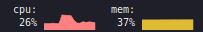

# graphinator

Simple widget for the XFCE desktop panel showing usage graphs for CPU and
memory.



## Motivation

There exist a few extensions/plugins for panels that display CPU/Memory usage.
But it's hard to come by one that meets all the requirements one would want.

- Efficiency. It would be a useless CPU usage meter if it used a noticeable
  amount of CPU performance. Once I tried a popular one that made my PC lag
  every time it took a measurement (it became noticeable while watching youtube
  videos and something didn't seem right with the video lagging every second
  (the PC wasn't particularly weak either)).

- Configurability. Allow for multiple colors, graph types etc. for display.

- Extensibility. Show other types of information, such as memory usage, net
  usage or even information from user provided script (but those are still to
  be done).

There are surely few that meet some or most of these requirements, and there
was one I used on Gnome. However, I wasn't able to find a good one for XFCE, so
I made this plugin which at partially satisfies my requirements. Perhaps the
remaining features in TODO are to be done some day when I stop procrastinating.

## Installation

```sh
# Prerequisites:
sudo apt update
sudo apt install xfce4-dev-tools \
    libxfce4ui-2-dev \
    libxfce4panel-2.0-dev \
    imagemagick \
    libgtk-3-dev

# Download:
git clone https://github.com/Bleskocvok/graphinator.git

# Build:
cd graphinator
sh ./configure
make
sudo bash script/install
```

## Activation

Right click on the XFCE panel → Panel → Add New Items… → Select `Graphinator`

## List of TODOs

- Show net usage (with sensible units, percentage makes little sense)
- Allow for custom monitoring (like `xfce4-genmon-plugin`)
- Settings for text orientation
- Show grid option
- Show background option
- Show ruler option
- Options to show all cpu cores
- ~~Simple bar graph rendering option~~
- More “multigraph” options (e.g., show download & upload using one graph with
  two colors)
- Package as .deb and potentially other formats
- Show all cpu cores/threads as separate graphs
